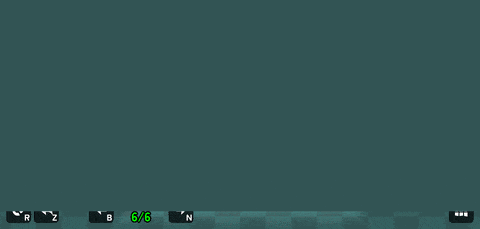
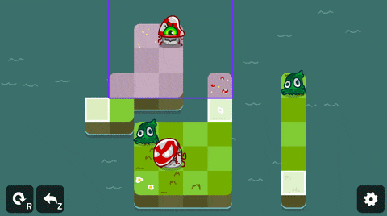
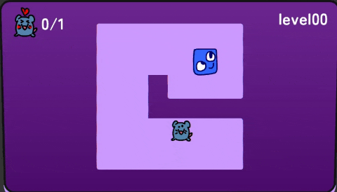
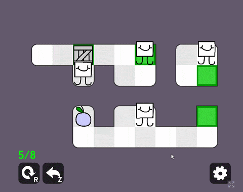

# Sokoban Barebones

Showcase: https://youtu.be/2lYtqUzJclg

A really simplistic boilerplate for your Sokoban puzzle based on the Heaps.io engine.

## Features
- Basic Sokoban game loop (move the boxes into green cells!)
- Connected blocks support
- Multi-agent movement support
- Mobile controls support (via swipes)
- Undo / Redo functionality; Restart can be undone as well!
- Save / Load progress
- Example CastleDB project for level data
- Built-in .pak generator for the assets (using [Heeps library](https://github.com/Yanrishatum/heeps))
- JSON-Array spritesheets support with type-safe references. If you use Adobe Animate, there's an example at `dev/sprites.fla`.
- Builds to HTML5 and Windows (the latter is experimental and untested, you might need to tweak `win.bat`)
- Simple UI

## Showcase

- [Drop da Myc](https://github.com/kr0tyara/ld59)

- [Pet da Rat](https://github.com/kr0tyara/pet-da-rat)

- [Bay ACCELERATE](https://github.com/kr0tyara/bay-accelerate)
## Controls
- WASD / Arrows - Movement
- Z / Right click - Undo 
- Y - Redo
- R - Restart

Add your own controls by modifying the `InputManager` class!

## Debug hotkeys
- B / N - Previous / Next level

These are defined in the `update` function inside the `Game` class.

## What to do next?
- Make UI!
- Add custom `entities`!
- Design some clever levels! :)
- Make some custom graphics (by modifying `avatars`)
- And contact me if you made something out of this!

## Dependencies
- [Heaps.io](https://github.com/HeapsIO/heaps)
- [CastleDB](http://castledb.org)
- [Actuate](https://github.com/openfl/actuate)
