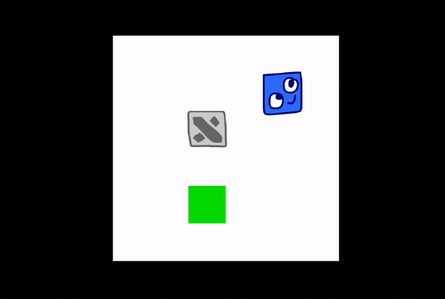

# Sokoban Barebones

A really simplistic boilerplate for your Sokoban puzzle based on the Heaps.io engine.

## Features
- Basic Sokoban game loop (move blue boxes into green cells!)
- Undo / Redo functionality
- Save / Load progress
- Simple scoring system based on the number of steps made to complete the level (displayed in the Console)
- Multiple playable characters at once ([desperatea](https://kr0tyara.itch.io/desperatea) style!)
- Example CastleDB project for level data
- Built-in .pak generator for the assets (using [Heeps library](https://github.com/Yanrishatum/heeps))
- Builds to HTML5 and Windows (the latter is experimental and untested, you might need to tweak `win.bat`)

## Dependencies
- [Heaps.io](https://github.com/HeapsIO/heaps)
- [CastleDB](https://lib.haxe.org/p/castle)

## Controls
- WASD / Arrows - Movement
- Z / Y - Undo / Redo

Add your own controls by modifying the `InputManager` class!

## Debug hotkeys
- R - Restart
- B / N - Previous / Next level

These are defined in the `update` function inside the `Game` class.

## What to do next?
- Make UI!
- Add custom `entities`!
- Design some clever levels! :)
- Make some custom graphics (by modifying `avatars`)
- And contact me if you made something out of this!